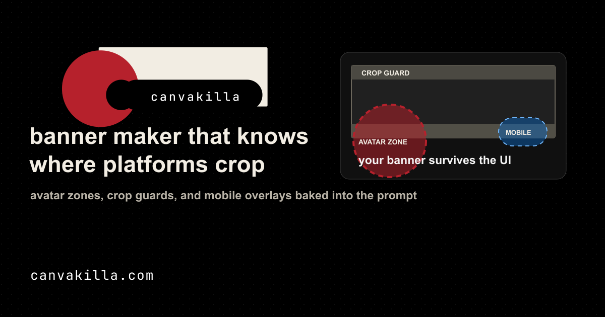

<div align="center">



# CanvaKilla

**The banner maker that knows where every platform actually crops.**

Built because Canva kept hiding banner text behind avatars, mobile follow-button overlays, and the 60-pixel strips X clips off the top and bottom on certain displays.

[](https://x.com/joewilsonai)
[](https://canvakilla.com)
[](https://nextjs.org)
[](https://vercel.com)
[](#license)

[**🔗 Try it live →**](https://canvakilla.com)

</div>

---

## Why

Canva's banner templates don't know where X crops your design.

- The **avatar circle** overlaps the lower-left of the banner — anything important there gets covered.
- The **mobile Follow / Edit profile / Message buttons** sit on top of the lower-right.
- X clips **roughly 60 pixels off the top and bottom** on certain display sizes.

Every banner template you load in Canva ignores all three. Your text ends up under your face. Your logo gets buried under a Follow button. Your tagline disappears behind an iPhone notch.

CanvaKilla bakes those crop guards into every prompt so the AI image model places content where it will actually be visible.

## How it works

CanvaKilla is a Next.js app that talks to image-generation models through OpenRouter (so spending stays capped on a single API key). The system prompt for every generation includes:

- **Avatar quiet zone** — keep faces, logos, and text out of the lower-left 34% width × 46% height
- **Mobile-action overlay** — keep the lower-right 200×100 pixels visually quiet for the Follow/Message buttons
- **Edge crop strips** — avoid critical detail in the top 60 px and bottom 60 px because some displays clip them
- **3:1 aspect** — final export at 1500 × 500 (X's banner dimensions)

The result is a banner that looks intentional on desktop *and* mobile, with your face and tagline still visible after the avatar lands.

## Features

- **Reference-driven iteration** — upload one or more reference images, label them `R1`, `R2`, etc., then iterate prompts that mention them by name
- **Two modes** — Banner (3:1 landscape) and Profile picture (1:1 square)
- **Live X-preview canvas** — switches between desktop and mobile X profile layouts so you can see the avatar circle, mobile-action overlay, and crop strips fall on your in-progress design
- **Multi-model** — pick between GPT Image 2 (slower, sharpest), Nano Banana 2 (fast, great for iteration), Nano Banana Pro (highest quality), or Nano Banana (legacy) — all routed through OpenRouter
- **Free, anonymous, no signup** — server-issued signed HttpOnly session cookies, multi-tier rate limiting, no account required
- **Workspace persistence** — references, profile photos, prompts, generated images, and history all survive refreshes via IndexedDB; one-click "Clear all local data" wipes it
- **Clean export** — 1500 × 500 PNG for banners, 1024 × 1024 PNG for profile pictures, optional circular-crop proof

## Try it

[**canvakilla.com**](https://canvakilla.com) — free until OpenRouter credits run out.

## Run locally

```bash
git clone https://github.com/PoliTwit1984/canvakilla
cd canvakilla
cp .env.example .env.local        # fill in OPENROUTER_API_KEY
npm install
npm run dev
```

Open `http://localhost:3000`, upload a reference image, type a prompt, hit Iterate.

### Environment variables

| Variable | Required | Notes |
|---|---|---|
| `OPENROUTER_API_KEY` | yes | Single key powers every model — set a spending cap on it |
| `CANVAKILLA_SESSION_SECRET` | production | Signs the anonymous-session cookie; rotate independently from provider keys |
| `NEXT_PUBLIC_SITE_URL` | recommended | Used for Open Graph image URLs and OpenRouter `HTTP-Referer` |
| `NEXT_PUBLIC_POSTHOG_PROJECT_TOKEN` | optional | Enables analytics; without it the site runs analytics-disabled |
| `NEXT_PUBLIC_POSTHOG_HOST` | optional | Defaults to `https://us.i.posthog.com` |
| `GENERATION_RATE_LIMIT_PER_MINUTE` | optional | Default 4 — per signed session |
| `GENERATION_RATE_LIMIT_PER_HOUR` | optional | Default 20 — per signed session |
| `GENERATION_IP_RATE_LIMIT_PER_MINUTE` | optional | Default 8 — per IP |
| `GENERATION_IP_RATE_LIMIT_PER_HOUR` | optional | Default 40 — per IP |
| `GENERATION_COST_LIMIT_PER_MINUTE` | optional | Cost-weighted budget per session — pricier models burn more |
| `GENERATION_COST_LIMIT_PER_HOUR` | optional | Cost-weighted hourly budget per session |
| `GENERATION_IP_COST_LIMIT_PER_MINUTE` | optional | Cost-weighted budget per IP |
| `GENERATION_IP_COST_LIMIT_PER_HOUR` | optional | Cost-weighted hourly budget per IP |
| `MAX_ACTIVE_GENERATIONS` | optional | Caps concurrent in-process generations |

### Security & ops notes

- **Server-issued anonymous sessions** — no login required, but every request is bound to a signed HttpOnly cookie. Set `CANVAKILLA_SESSION_SECRET` in production.
- **Multi-tier rate limiting** — per signed session AND per IP, plus a separate **cost-weighted limiter** so a user picking GPT Image 2 burns more of the budget than someone picking Nano Banana. Configurable per env var (above).
- **Upload validation** — references are capped at 8 MB client-side, must be PNG / JPEG / WebP (validated by magic bytes, not just MIME), and the full request is capped at 4 MB after client-side compression.
- **PostHog events are sanitized** — autocapture, exception capture, session recording, pageview/pageleave, and raw provider error messages are all disabled. Only the explicit funnel events fire.
- **In-memory limits are per server instance.** For heavy launches, move rate-limit and active-generation state to a shared store like Vercel KV or Redis.

## Stack

- **Next.js 15** App Router, server components for the API route
- **TypeScript**
- **Tailwind CSS** for the UI
- **OpenRouter** for unified image-model access (GPT Image 2, Gemini Flash Image variants)
- **PostHog** for product analytics (optional, sanitized)
- **Vercel** for hosting and edge serverless deployment
- **IndexedDB** for client-side workspace persistence

## Roadmap

- [x] **X banner mode** (1500 × 500, 3:1) — shipped May 2026
- [ ] **LinkedIn banner mode** (1584 × 396, 4:1) — different profile photo overlay coords, no mobile-action overlay (LinkedIn UI doesn't overlap the banner)
- [ ] **Instagram header mode**
- [ ] **TikTok profile banner mode**
- [ ] **Facebook cover photo mode**

Every platform's quiet zones and crop math get baked into the prompt the same way.

## Build in public

CanvaKilla shipped in a single Saturday from idea to deployed product, built with Claude Code + Codex.

The full audit (35 issues across HIGH / MEDIUM / LOW severity, four reviewers — codex, Claude Opus, Nyx, Gemini) is open in the [Issues](https://github.com/PoliTwit1984/canvakilla/issues) tab. Most HIGH-severity findings have already been resolved (signed-session cookies, magic-byte upload validation, cost-weighted rate limiting, sanitized analytics). PRs welcome on the rest.

Follow the build-in-public posts on [@joewilsonai](https://x.com/joewilsonai).

## Contributing

PRs welcome. The repo runs an automated **codex review** on every PR via a self-hosted runner — see `.github/workflows/codex-review.yml`. Reviews post HIGH-severity findings as PR comments and the full report as a JSON artifact.

For non-trivial changes, open an issue first so we can talk through the approach.

## License

MIT — see [LICENSE](LICENSE)

## Credits

- **OpenRouter** for unified model routing with single-key spending caps
- **Vercel** for hosting + preview deploys per PR
- **Hostinger** for DNS
- **PostHog** for the analytics pipeline
- **Claude Code** + **Codex** — the AI build partners that shipped this

---

<div align="center">

**Built by [@joewilsonai](https://x.com/joewilsonai)**
<br/>
<i>If your text is hiding behind your avatar right now, this fixes it.</i>

</div>
